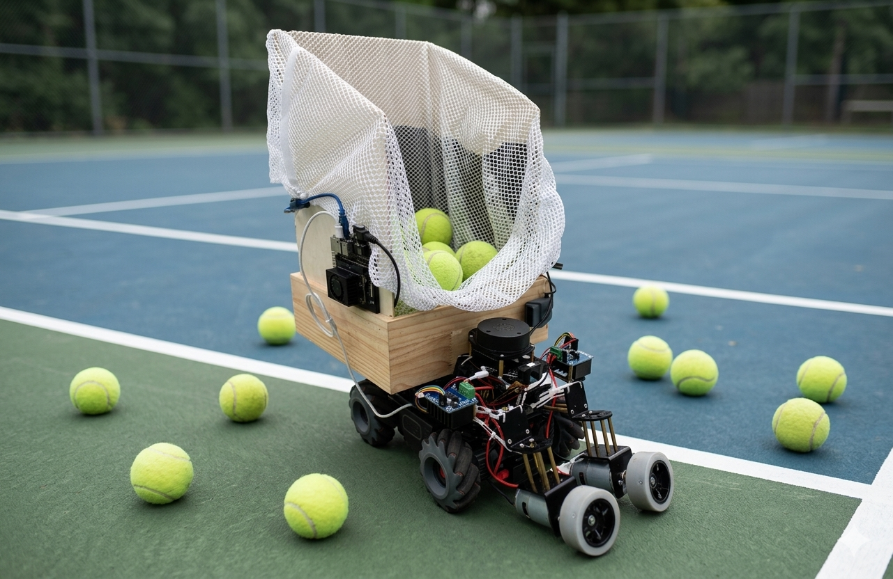
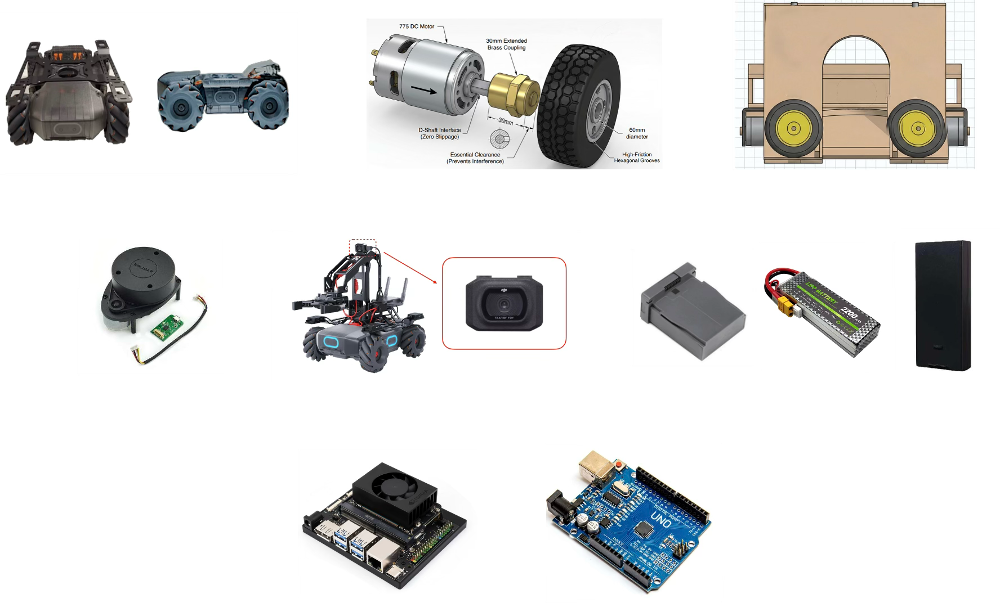
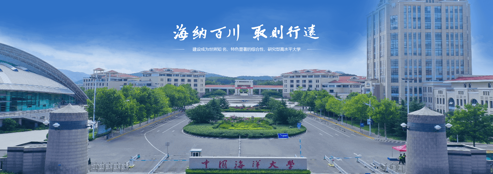

 
    <h1> CourtSweeper </h1>
    <h2> A Vision-Based Tennis Ball Retriever with Dual-Roller Intake Mechanism. </h2>

    <h3>
        Team #13:
        <a href="https://github.com/RamessesN">Yuwei ZHAO</a>,
        <a href="https://github.com/aiCane">Yilin ZHANG</a>,
        <a href="https://github.com/Rossiga22">Shijia LUO</a>,
        <a href="https://github.com/SusanSun1001">Yingrui SUN</a>
    </h3>

---

## I. Introduction

This repository contains the software and hardware integration code for an autonomous tennis ball collection robot. The system utilizes a Jetson Orin NX to process visual and spatial data. It identifies tennis balls using a YOLO26 vision model and navigates the environment using a ROS2-based SLAM implementation. The physical ball collection is executed by a custom dual-motor friction wheel mechanism. A native Swift iOS application serves as the user interface for telemetry visualization and emergency control.

---

## II. Demonstration
TODO

---

## III. Project Struture
### 1. Mainbody
<pre>
<code>CourtSweeper/
├── doc/                        # Development Logs
│   ├── figures/
│   └── log/
│       └─ development_log.md
├── paper/                      # Report
│   ├── proj_proposal/
│   └── final_report/
├── ref/                        # Reference
├── ROS/                        # ROS-relative
│   ├── config/
│   └── map/
├── src/                        # Source code
│   ├── chassis/
│   │   └── ...
│   ├── distance/
│   │   └── ...
│   ├── lidar/
│   │   └── ...
│   ├── map/
│   │   └── ...
│   ├── roller/
│   │   └── ...
│   ├── vision/
│   │   └── ...
│   ├── env_config.py
│   └── main.py
├── User Interface/             # Swift App
├── LICENSE
└── README.md</code>
</pre>

### 2. Submodule
> Source code part

 Vision Module 

<pre>
<code>vision/
├── mlmodel/
│   ├── engine/       # TensorRT model
│   ├── onnx/         # ONNX model
│   └── pt/           # Pt model
│
├── training/         # model training-related
│   ├── dataset/
│   ├── runs/
│   ├── weight/
│   ├── dataset_collect.py
│   └── model_training.py
├── cv_config.py      # cv-related env config
└── video_node.py     # load vision model</code>
</pre>

 Chassis Module 

<pre>
<code>chassis/
├── chassis_ctrl.py    # chassis mov ctrl
└── chassis_sub.py     # chassis info sub</code>
</pre>

 Distance Module 

<pre>
<code>distance/
└── distance_sub.py     # distance info sub</code>
</pre>

 Lidar Module 

<pre>
<code>lidar/
├── lidar_parse.py                    # RPLidar (test only)
└── x2_lidar_parse(deprecated).py     # YDLidar (test only)</code>
</pre>

 Map Module 

<pre>
<code>map/
├── map_generation.py    # slam mapping
├── map_navigation.py    # slam navigation
└── workflow.md</code>
</pre>

 Roller Module 

<pre>
<code>roller/
├── roller_drive.py
└── roller_setting.ino   # Arduino blink
</code>
</pre>

 

> User Interface part

 User Interface (TODO) 

<pre>
<code>User_Interface/
├── CourtSweeper.xcodeproj              # Xcode project config
├── CourtSweeper/
│   ├── App/
│   │   └── CourtSweeperApp.swift       # App entry point
│   │
│   ├── Models/
│   │   └── RobotCell.swift             # Data model
│   │
│   ├── ViewModels/
│   │   └── RobotControlViewModel.swift # State management hub
│   │
│   ├── Views/
│   │   ├── RobotControlView.swift      # Main control interface
│   │   └── Components/                 # Reusable UI components folder
│   │       ├── VideoStreamCard.swift   # Video player container
│   │       └── GridMatrixView.swift    # Grid matrix container
│   │
│   └── Assets.xcassets/                # Media asset catalog</code>
</pre>

---

### IV. System Details
1. **Hardware Architecture**

- **Chassis Platform:** A DJI RoboMaster chassis provides mobility, camera input, infrared sensor and wireless communication.
- **Edge Computing:** A Jetson Orin NX serves as the primary computational platform. It operates headlessly using a display emulator and VNC.
- **Spatial Mapping:** An RPLidar A1M8 transmits 2D spatial data via serial communication. Due to chassis occlusion, the functional field of view is restricted to a 180-degree forward-facing arc.
- **Actuation Control:** An Arduino Uno acts as the lower-level microcontroller. It receives serial commands from the Jetson to drive the custom friction wheel intake mechanism using BTS7960 motor drivers and 755 motors.
- **Power Distribution:** Power is physically isolated across three independent circuits to maintain electrical stability - Jetson Orin NX: 12V 6800mAh battery; Intake Mechanism: 11.1V 3S 5200mAh LiPo battery; RoboMaster Chassis: Factory default battery.

2. **Software Environment**
- **Operating System:** The system runs on Ubuntu 22.04 with JetPack 6.2.1.
**Process Isolation:** Vision and navigation stacks are isolated to prevent dependency conflicts.
- **Vision Stack:** The YOLO26 model executes within a dedicated Conda environment.
- **Navigation Stack:** ROS2 SLAM applications operate directly within the native system environment.
- **Communication Bridge:** A custom ROS2 node handles cross-environment data exchange. It interfaces with a modified SDK (Robomaster-SDK-Ultra) compatible with newer Python versions to manage velocity commands, odometry calculations, TF broadcasting, and image stream publishing.

The core dependencies are listed below:

| Environment | Version                    |
|-------------|----------------------------|
| JetPack     | 6.2.1                      |
| Ubuntu      | 22.04 Jammy                |
| CUDA        | 12.6.68                    |
| cuDNN       | 9.3.0.75                   |
| VPI         | 3.2.4                      |
| Vulkan      | 1.3.204                    |
| Python      | 3.10.12                    |
| OpenCV      | 4.11.0 with CUDA: YES      |
| PyTorch     | 2.5.0a0+872d972e41.nv24.8 (torchvision 0.20.0a0+afc54f7) |
| TensorRT    | 10.3.0                     |

---

### V. Limitations and Future Work
1.	Due to fabrication constraints, the mechanical stability of the custom dual-friction wheel structure requires further optimization.
2.	SLAM mapping degrades in wide-open outdoor environments, leading to reduced navigation reliability.
3.	The communication bandwidth of the RoboMaster chassis limits data throughput, constraining high-frequency data processing.
4.	The current lidar configuration is restricted to a three-directional field of view. Future designs will implement an unoccluded 360-degree sensor placement.
5.	The iOS application requires further feature development and user interface refinements.

---

#### ⚠️ License: This project isn't open-source. See Details [LICENSE](LICENSE).

